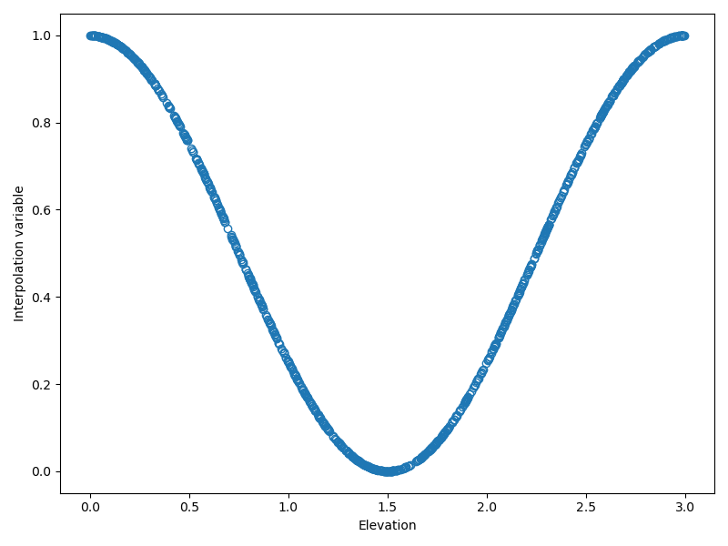
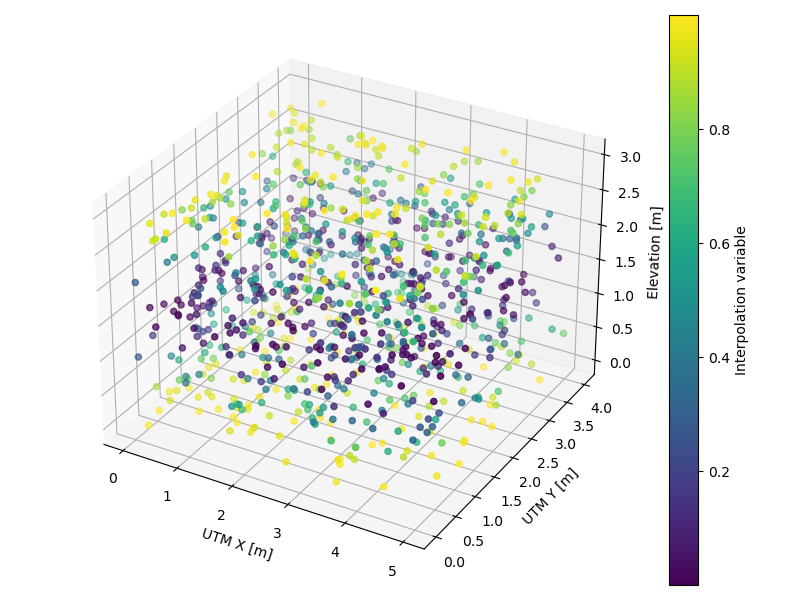
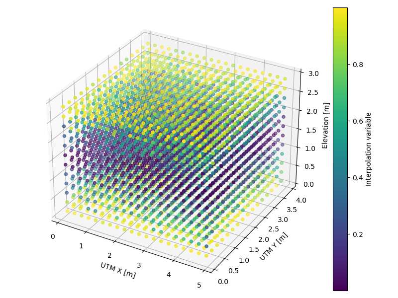
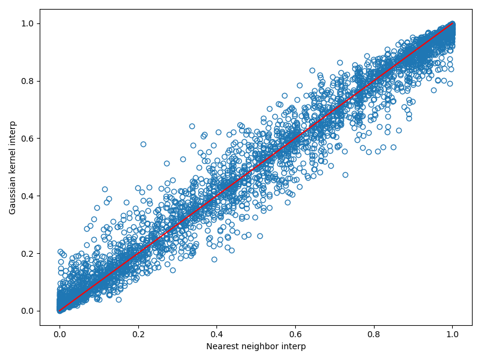

# Gaussian-kernel-interpolation
Voxelize a point-cloud variable via Gaussian kernel interpolation to voxel centers

```python
import numpy as np
from scipy.spatial import cKDTree as kdtree
from mpl_toolkits.mplot3d import Axes3D
from matplotlib import pyplot as pl

shape = (3, 4, 5) # [meters]
num = 1000
voxel_width = 0.25 # 25 cm
sigma = voxel_width / 2

def gaussian_weights(r, sigma):
    return np.exp(-r*r/sigma/sigma/2)

# point cloud data
pts = np.c_[shape[2] * np.random.random(num),
            shape[1] * np.random.random(num),
            shape[0] * np.random.random(num)]

# interpolation variable
var = np.cos(pts[:,2]/shape[0]*np.pi)**2

# get a visual impression
fg = pl.figure(1, (8, 6))
ax = fg.add_subplot(111)
ax.plot(pts[:,2], var, 'o', mfc = 'none')
ax.set_xlabel('Elevation')
ax.set_ylabel('Interpolation variable')
pl.tight_layout()
pl.savefig('interp-var-2d.png')
pl.close('all')
```


```python
# in 3d
fg = pl.figure(1, (8, 6))
ax = fg.add_subplot(111, projection = '3d')
ob = ax.scatter(pts[:,0], pts[:,1], pts[:,2], c = var)
cb = fg.colorbar(ob)
cb.set_label('Interpolation variable')
ax.set_xlabel('UTM X [m]')
ax.set_ylabel('UTM Y [m]')
ax.set_zlabel('Elevation [m]')
pl.tight_layout()
pl.savefig('interp-var-3d.png')
pl.close('all')
```


```python
# voxel bounds
vxb = np.linspace(0, shape[2], int(shape[2]/voxel_width)+1)
vyb = np.linspace(0, shape[1], int(shape[1]/voxel_width)+1)
vzb = np.linspace(0, shape[0], int(shape[0]/voxel_width)+1)

# voxel center coordinates
vyc, vzc, vxc = np.meshgrid((vyb[1:]+vyb[:-1])/2,
                            (vzb[1:]+vzb[:-1])/2,
                            (vxb[1:]+vxb[:-1])/2)
vxl = np.c_[vxc.ravel(), vyc.ravel(), vzc.ravel()]

# KD-Tree
tree = kdtree(pts)

# nn query as a sanity check
dd, ii = tree.query(vxl, k = 1)
var_nn = var[ii]
fg = pl.figure(1, (8, 6))
ax = fg.add_subplot(111, projection = '3d')
ob = ax.scatter(vxl[:,0], vxl[:,1], vxl[:,2], c = var_nn)
cb = fg.colorbar(ob)
cb.set_label('Interpolation variable')
ax.set_xlabel('UTM X [m]')
ax.set_ylabel('UTM Y [m]')
ax.set_zlabel('Elevation [m]')
pl.tight_layout()
pl.savefig('voxelized-var-nn.png')
pl.close('all')
```


```python
# it would be more honest to take a ball neighborhood,
# but I'll just take the 20 nn for speed and simplicity
# problem: nn might not form a sphere
dd, ii = tree.query(vxl, k = 20)
wi = gaussian_weights(dd, sigma)
vi = var[ii]

# Gaussian kernel interpolation
var_gki = np.sum(vi*wi, axis = 1) / np.sum(wi, axis = 1)
fg = pl.figure(1, (8, 6))
ax = fg.add_subplot(111, projection = '3d')
ob = ax.scatter(vxl[:,0], vxl[:,1], vxl[:,2], c = var_gki)
cb = fg.colorbar(ob)
cb.set_label('Gaussian kernel interpolation')
ax.set_xlabel('UTM X [m]')
ax.set_ylabel('UTM Y [m]')
ax.set_zlabel('Elevation [m]')
pl.tight_layout()
pl.savefig('voxelized-var-gki.png')
pl.close('all')
```


```python
# what are the differences
fg = pl.figure(1, (8, 6))
ax = fg.add_subplot(111)
ax.plot(var_nn, var_gki, 'o', mfc = 'none')
ax.plot([0,1], [0,1], 'r-')
ax.set_xlabel('Nearest neighbor interp')
ax.set_ylabel('Gaussian kernel interp')
pl.tight_layout()
pl.savefig('voxelized-var-nn-gki-diff.png')
pl.close('all')
```

